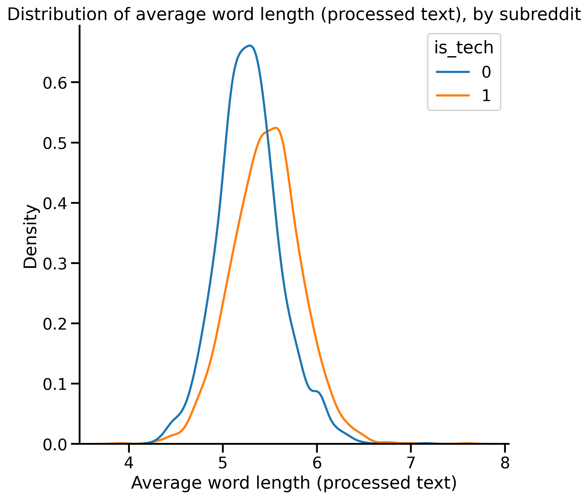
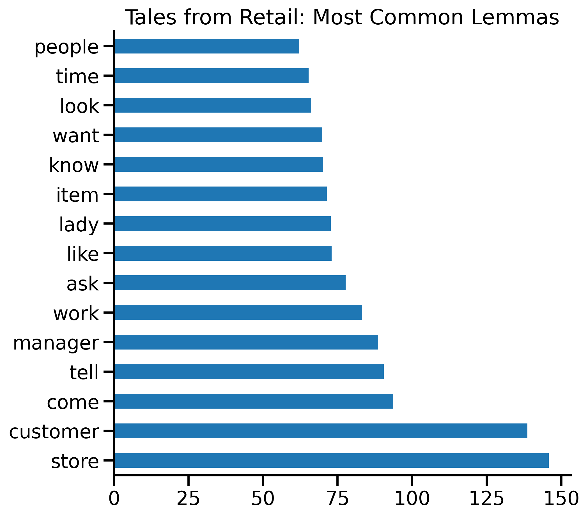
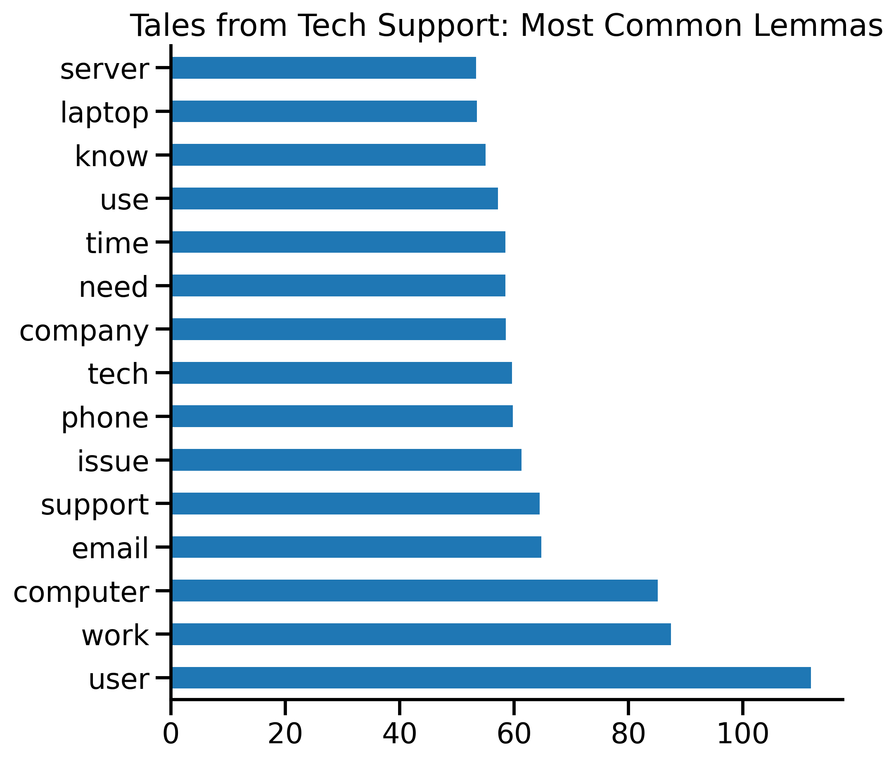
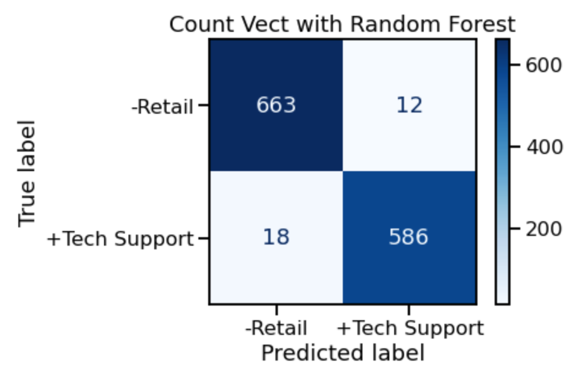
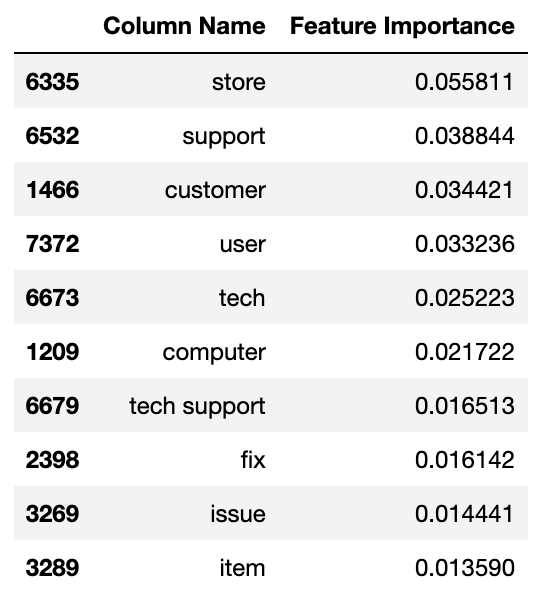

# Natural Language Processing to Advance Automation: What is the Role of the Human Agent in the Customer Journey?
Jill Mizell

# Executive Summary

**What is the role of the "human agent" in the customer journey?** Many aspects of customer service are increasingly being automated. Artificial intelligence (AI), combined with customer relationship management (CRM) software, are working in combination to find efficiencies, increase customer satisfaction, and improve the work lives of customer support specialists. Taken together, these emerging technologies can automate routine tasks and support "human agents" by providing them with tools and insights to resolve customer issues quickly and efficiently.

Automation is on the rise, and the use cases are expanding rapidly. Research shows that by 2022, 70% of customer interactions will involve emerging technologies, up from 15% in 2018 ([Gartner 2020](https://www.gartner.com/smarterwithgartner/top-cx-trends-for-cios-to-watch)). In just the retail sector, the automation market was valued at \$12.45 billion in 2019, and predictions for 2025 place the value at \$24.6 billion ([Mordor Intelligence via Technology Review, 2020](https://www.technologyreview.com/2020/09/17/1008148/from-support-function-to-growth-engine-the-future-of-ai-and-customer-service/)). From speeding up response times and addressing the most common FAQs to anticipating problems and enhancing human interaction, there's more and more uses for AI in customer service ([Forbes 2021](https://www.forbes.com/sites/forbesbusinesscouncil/2021/07/22/15-ways-to-leverage-ai-in-customer-service/?sh=4c560fb220bb)). And the move towards automation is creating efficients: a Salesforce study found that the large majority (82%) of customer service organizations using AI saw increases in the number of cases that were resolved on first contact ([Salesforce, 2018](https://c1.sfdcstatic.com/content/dam/web/en_us/www/documents/reports/salesforce-research-third-edition-state-of-service.pdf)).

Customer service is most often measured in one direction; feedback from customers is frequently sought, and satisfaction is proactively assessed. There is also value in understanding the experiences of those on the "front lines" of customer service in a range of contexts. *The goal of this natural language processing classification exercise is to to explore the more extreme customer service experiences in two distinct contexts - retail and tech support - to anticipate challenges and facilitate more advanced automation where possible, and employee support where automation is still not possible.*

Both are roles in service of customers and clients, although the nature of these roles and  clientele are distinct. The data for this analysis are from two subbreddits: Tales from Retail and Tales from Tech Support. [Tales from Retail](https://www.reddit.com/r/TalesFromRetail/) is a forum for retail employees to exchange stories about their daily experiences in brick & mortar retail; membership is at 644K. [Tales from Tech Support](https://www.reddit.com/r/talesfromtechsupport/) is a forum where employees in IT post stories about helping someone with a tech issue. Their slogan is "Did you try turning it off and on again?" Membership is at 722K. *How distinct are these two different frontline customer service experiences, and what is driving the distinction?*

# Getting the Data

Data were obtained using the Pushshift Reddit API using a function that returned a maximum of 100 posts over a 7-day time window, ensuring several seconds elapsed between get calls so as not to trigger the servers rate-limiting feature. To obtain enough valid observations, I pulled posts as far back as 100 weeks for retail, and 80 weeks for tech support. This resulted in 8,163 total posts for retail, 5,238 of which were 'removed' (and hence empty of any text), netting 2,925 usable posts. The result for tech support was 4140 total posts, 1,637 of which were 'removed', netting 2,503 usable posts. The total number of raw observations after data collection and initial filtering is 5,428.

# Preparing the Data

Initial exploratory data analysis on the raw dataset revealed a number of additional steps needed to clean and process the data before feature engineering and modeling.
- 289 rows with missing values in the text column were dropped
- 24 rows with 'deleted' in place of text were dropped
- 4 columns weren't needed for analysis and were dropped

There are three text columns used for analysis, each with different levels of text processing:
- 'selftext': the original, raw text data
- 'title_text': aka minimally processed text; combined the title with the raw text data, lowercased the text, replaced youtube links with 'youtube', removed other links as well as references to the subreddit names
- 'title_text_lemma': aka processed text; put the title_text data through a spaCy tokenizing function that extracted the lemmas, removed numbers, and removed spaCy English stop words

Finally, I created 9 features for exploratory data analysis on the text:
- Character length: the length of the document in character count (on the raw, minimally processed, and processed text)
- Word count: the length of the document in word count (on the raw, minimally processed, and processed text)
- Average word length: the average word length of the document (on the raw, minimally processed, and processed text)

### Data Dictionary

The final number of observations in the cleaned dataset is n = 5,115.

| Column Name | Data Type | Description |
| --- | --- | --- |
| title | object | The document (reddit post) title text |
| selftext | object | The raw document (reddit post) text |
| subreddit | object | The name of the subreddit containing the post |
| num_comments | integer | The number of comments in response to a post |
| timestamp | datetime | The date the post was posted |
| is_tech | integer | The class |
| title_text | object | The minimally processed document (reddit post) title and text|
| title_text_lemma | object | The processed document (reddit post) title and text |
| char_length_selftext | integer | The character count, raw text |
| word_count_selftext | integer | The word count, raw text |
| avg_word_length_selftext | float | The average word length, raw text |
| char_length_title_text | integer | The character count, minimally processed text |
| word_count_title_text | integer | The word count, minimally processed text |
| avg_word_length_title_text | float | The average word length, minimally processed text |
| char_length_lemma | integer | The character count, processed text |
| word_count_lemma | integer | The word count, processed text |
| avg_word_length_lemma | float | The average word length, processed text |

# Exploratory Data Analysis

The number of posts from retail is 2,671 (52%), and the number of posts from tech support is 2,444 (48%).

Compared to tech support, retail had slightly shorter posts by character count and word count, across the three text columns (raw, minimally processed, and processed). Retail had slightly shorter average word length compared to tech support.

The most common lemmas showed some distinction between the subreddits, with the top occurring words for retail being "customer" and "store", and the top occurring words for tech support being "work" and "user".

# Modeling

I fit eight different models to see which had the highest accuracy. The approach varied along four main characteristics:
- Data: half of the models used the minimally processed text data and half used the processed text data
- Processing: half of the models used TF-IDF and half used Count Vectorizer
- Model: half of the models used Multinomial Naive Bayes and half used Random Forest Classifier
- Hyperparameter tuning: half of the models used GridSearch and half used RandomizedSearch

### Modeling Results

All of the models outperformed the null or baseline model (52% accuracy). The models using the minimally processed text data were slightly more overfit compared to those with the processed data. All of the models fit on the processed training data had comparable validation set scores.

| Data | Process | Model + Search | Train Accuracy | Test Accuracy |
| --- | --- | --- | --- | --- |
| Processed | TF-IDF | MNB + Grid | 0.982 | 0.976 |
| Min Processed | TF-IDF | MNB + Grid | 0.984 | 0.972 |
| Processed | TF-IDF | RFC + Rand | 0.992 | 0.9765 |
| Min Processed | TF-IDF | RFC + Rand | 0.995 | 0.974 |
| Processed | Count Vect | MNB + Grid | 0.985 | 0.9765 |
| Min Processed | Count Vect | MNB + Grid | 0.983 | 0.974 |
| *Processed* | *Count Vect* | *RFC + Rand* | *0.992* | *0.9765* |
| Min Processed | Count Vect | RFC + Rand | 0.991 | 0.972 |

The Count Vectorized Random Forest Classifier model on the processed data yielded high accuracy (0.9765), recall (0.97), and precision (0.98), as well as a set of important features.

# Conclusion

Customer service challenges vary depending on context. Retail and tech support professionals face different types of customer challenges. Ultimately the goal of automation is to "automate with intelligence" and enhance human interactions - to outsource the worst parts of the job to machines so humans have more and better tools and higher quality jobs.

Next steps to build on this project include exploring for additional distinctions between these groups via sentiment analysis and language in context.
