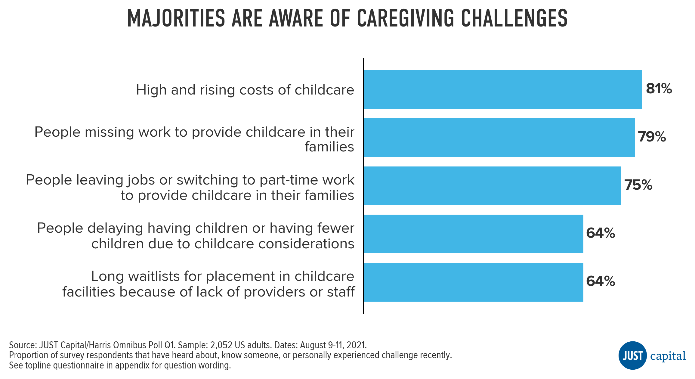
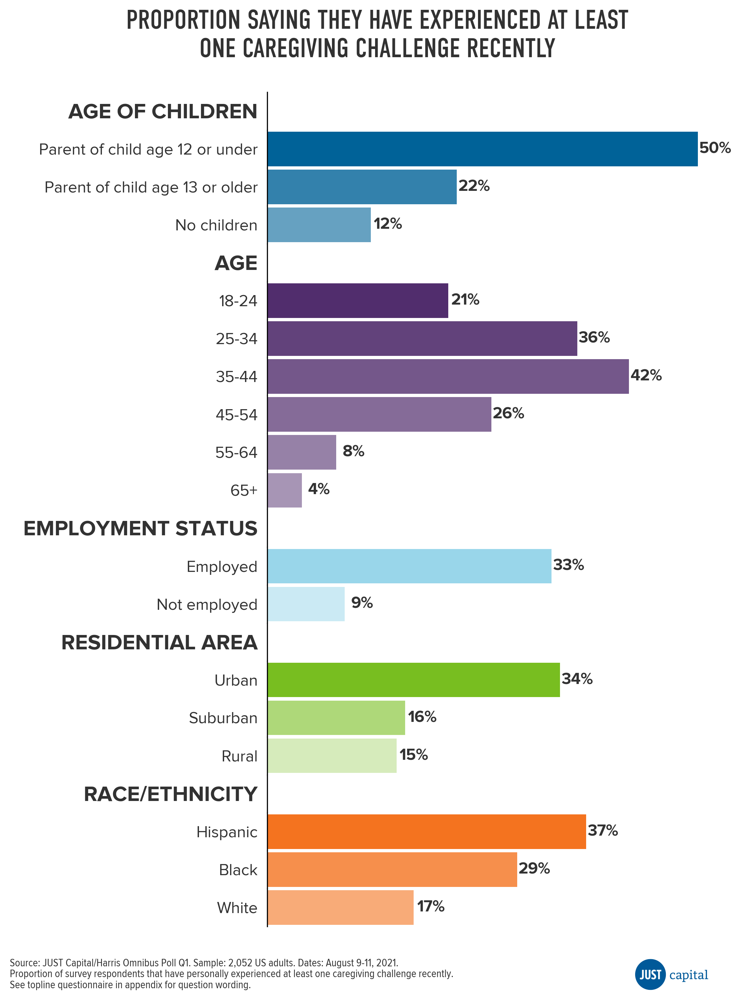
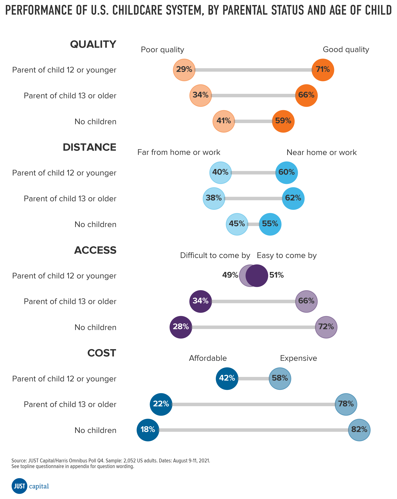
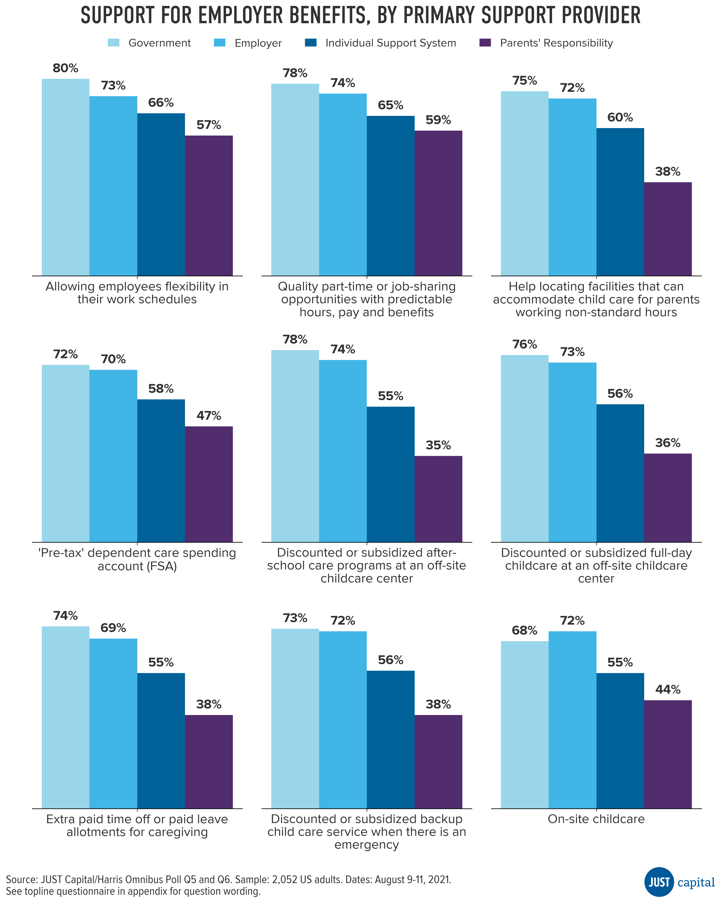

# Public Opinion on Child Care in the U.S.

In September of this year, the U.S. Department of Treasury released a [report](https://home.treasury.gov/system/files/136/The-Economics-of-Childcare-Supply-09-14-final.pdf) on the status of child care in the U.S., describing the system as a “market failure” that has led to “chronic underinvestment in our children.” One of the main reasons why child care is a market failure is because care for most children, particularly young children under the age of 5, relies on private financing at a stage in life when parents are least able to afford it. A 2019 [report](https://www.americanprogress.org/issues/early-childhood/reports/2019/03/28/467488/child-care-crisis-keeping-women-workforce/) by the Center for American Progress found that the cost of child care has more than doubled in the last 20 years, and U.S. families are suffering — many parents report spending most of their paycheck on child care expenses, and half of families say it’s difficult to find child care.

Despite the high cost to parents, child care providers operate in impossibly thin profit margins (1% or less) and are forced to keep labor costs low in order to stay afloat (Treasury report). Because it’s so financially difficult to operate as a child care provider, there are a low number of providers relative to the number of young children that need care. More than half of Americans live in a “child care desert” - where there are more than three young children for every licensed child care slot ([CAP 2018](https://www.americanprogress.org/issues/early-childhood/reports/2018/12/06/461643/americas-child-care-deserts-2018/)).

Even before the pandemic, child care in the United States was increasingly inaccessible for many parents, but the COVID-19 pandemic made a bad situation worse for families as well as child care providers. Treasury reports that by October of 2020, 166,000 child care workers had lost their jobs, and the industry was 83% smaller compared to February 2020. According to [research](https://bipartisanpolicy.org/blog/nationwide-survey-child-care-in-the-time-of-coronavirus/) by the Bipartisan Policy Center, 60% of child care centers closed down during the height of the pandemic, and while many have since reopened, they have reduced capacity to meet safety requirements.

# Methodology

This survey was conducted online within the United States by The Harris Poll in partnership with JUST Capital between August 9-11, 2021 among 2,052 U.S. adults ages 18 and older.

Survey respondents were recruited from online panels of people who agreed to participate in survey research. All panelists completed a “confirmed” or “double opt-in” process. Panelists were sent an email invitation to access the survey online with a URL link and custom password ensuring each respondent was only able to take the survey once.		

Sampling and weighting targets were derived from the March 2020 U.S. Census Current Population Survey (CPS). Target variables included age by gender, race/ethnicity, education, region, and household income. While every effort is made to ensure a balanced sample through recruitment, the final data were weighted post-field to adjust for any sample imbalances and ensure representativeness.		

In addition to weighting by the aforementioned known demographic variables, results are also weighted to key attitudinal and behavioral measures that Harris has determined are indicators of one’s propensity to be online or part of a panel. Harris’s proprietary two-pronged weighting process (i.e., demographic and propensity) takes into account two issues related to online research: 1) that not everyone is online, and 2) that not everyone who is online is part of a research panel.

Because the sample is based on those who were invited and agreed to participate in research panels rather than a random sample of respondents, no estimates of theoretical sampling error can be calculated, and there is no margin of sampling error reported. This survey is not based on a probability sample, and is not representative.

# Key Findings

Majorities are aware of a number of child care challenges faced by parents in the U.S. (81% are aware of the high and rising costs of child care), but parents with young children (age 12 or younger) are the most likely subgroup to have either personally experienced or to know someone who has experienced a list of child care challenges recently (85% know someone or have experienced at least one child care challenge, compared to 59% overall).

Some demographic subgroups are disproportionately affected by child care challenges:
- People who are Hispanic (37%) or Black (29%) are more likely than white people to say they’ve experienced at least one caregiving challenge recently.
- People who are employed (33%) are much more likely to experience child care challenges than those who aren’t (9%).
- People living in urban areas (34%) are also more likely to experience caregiving challenges compared to their suburban (16%) and rural counterparts (15%).

People are generally positive about the ability of the U.S. child care system to meet the needs of different stakeholders and the quality of care provided:
- Most respondents generally have positive views about the ability of the child care system to meet the needs of parents (62% good), children (53% good) and child care workers (53% good), but acknowledge that parents with non-standard working hours may be underserved (44% poor vs 41% good).

- Most respondents also give the child care system positive marks for quality (63% believe it is good quality) and location (57% believe it is near home or work), but acknowledge that access (66% believe it is difficult to come by) and affordability (76% believe it is expensive) may be issues for the average family.

- Parents with a young child (age 12 or younger) are more likely than those with children over the age of 12 and those without children to say the child care system is doing well to address the needs of various stakeholders and are generally more positive about quality (71% believe it is good quality), location (60% believe it is near home or work), access (51% believe it is easy to come by), and affordability (42% believe it is affordable).

Opinions are split about which institution should take primary responsibility for supporting parents struggling with child care challenges, but majorities support a range of employer benefits for parents and a large majority supports a federal paid leave policy:
- When asked which institution should play a primary role in helping parents struggling to find quality, affordable child care, 46% supported broader, more collective institutions (government or employers) and 40% supported smaller, more individual groups (parents’ support system of family and friends, or it’s the parents’ responsibility to help themselves).

- There is broad support for a range of employer benefits for parents, with 67% saying companies should provide flexible work schedules and 66% saying companies should provide quality job-sharing and part-time work opportunities. Support increases among those that see child care access as a collective responsibility (government or employers playing a role) compared to those that see it as an individual responsibility (support system or parents’ responsibility alone).

- A vast majority (78%) supports a federal policy that requires employers to provide up to 12 weeks of paid leave for workers or who need to take care of a sick spouse, child, or parent. Support for the federal policy is higher among those that see child care access as a collective responsibility compared to those that see it as an individual responsibility.

