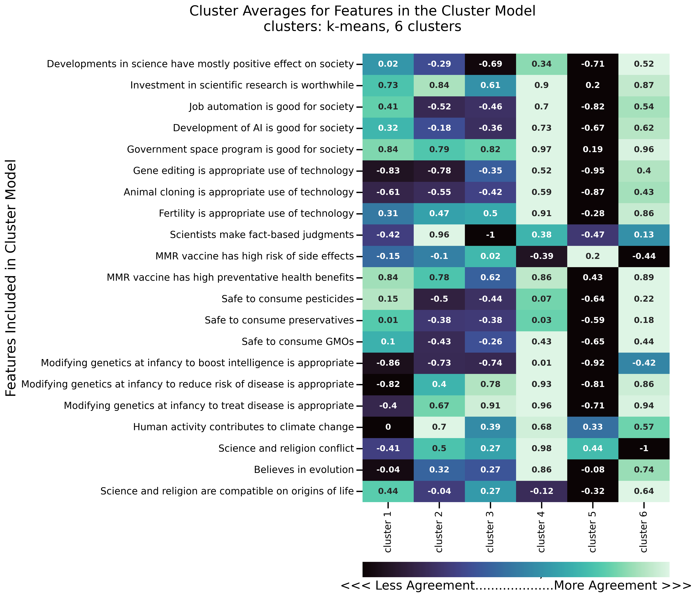
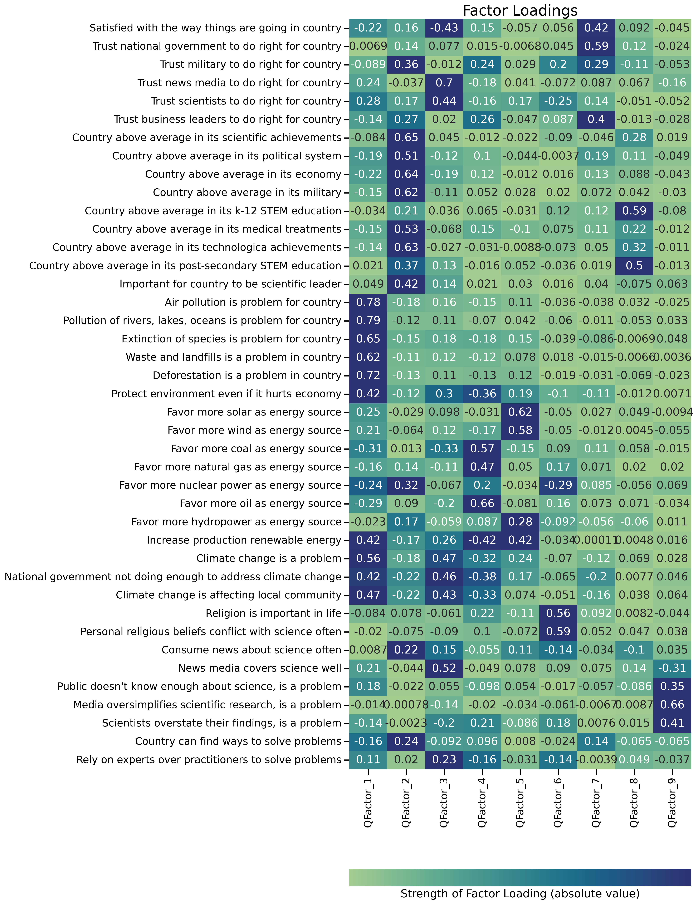
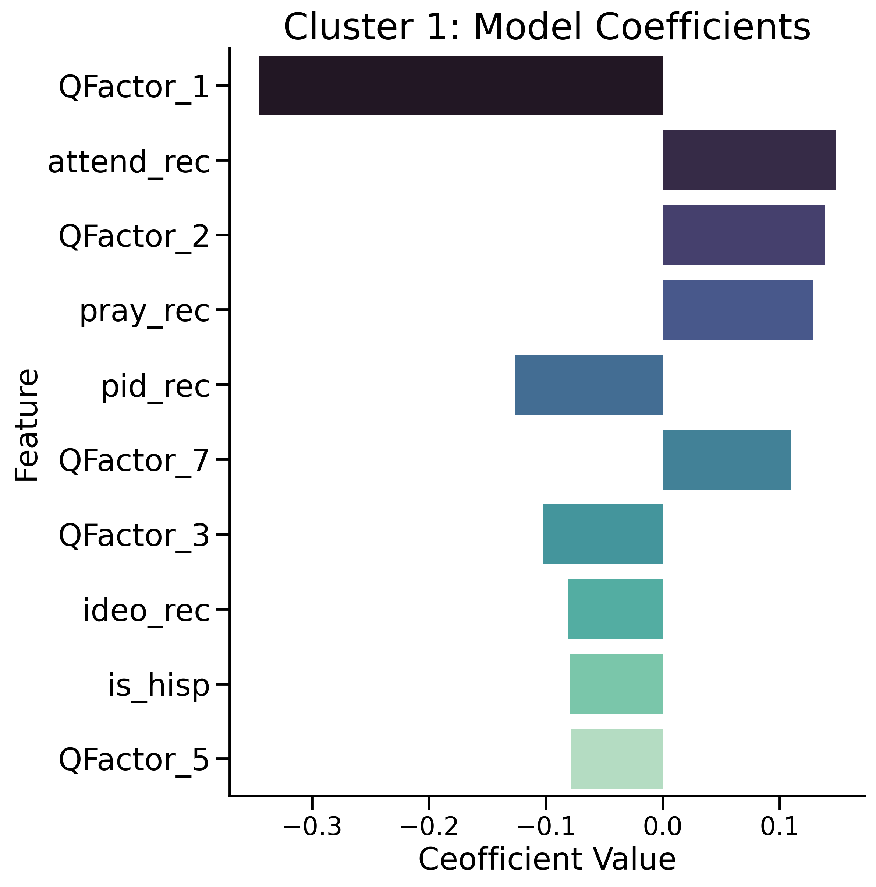
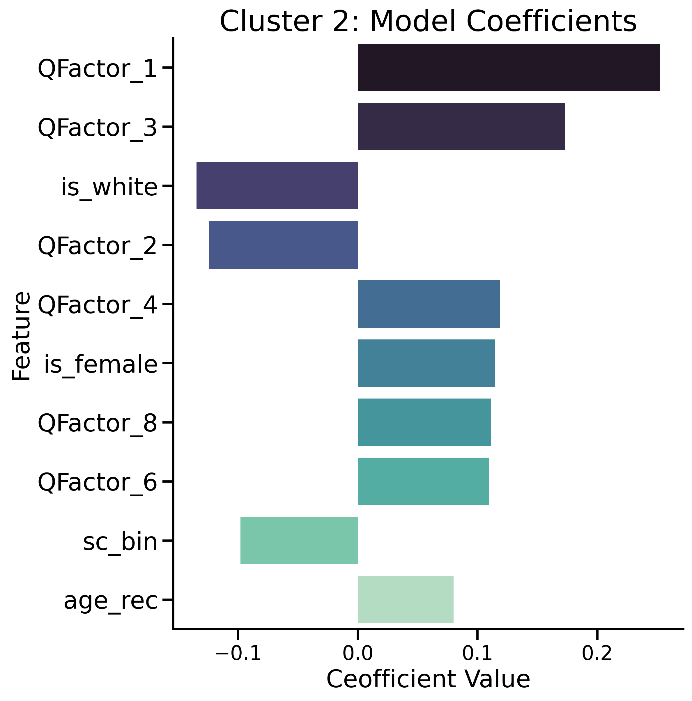
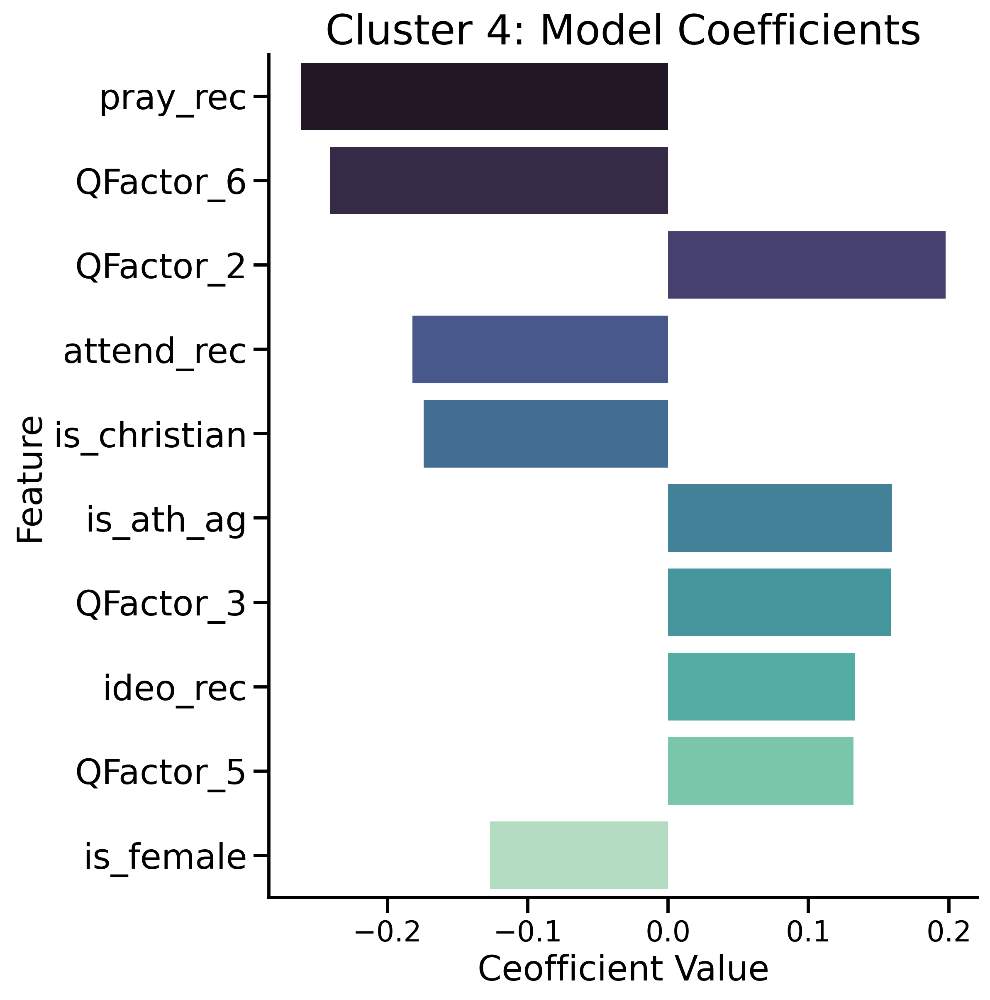
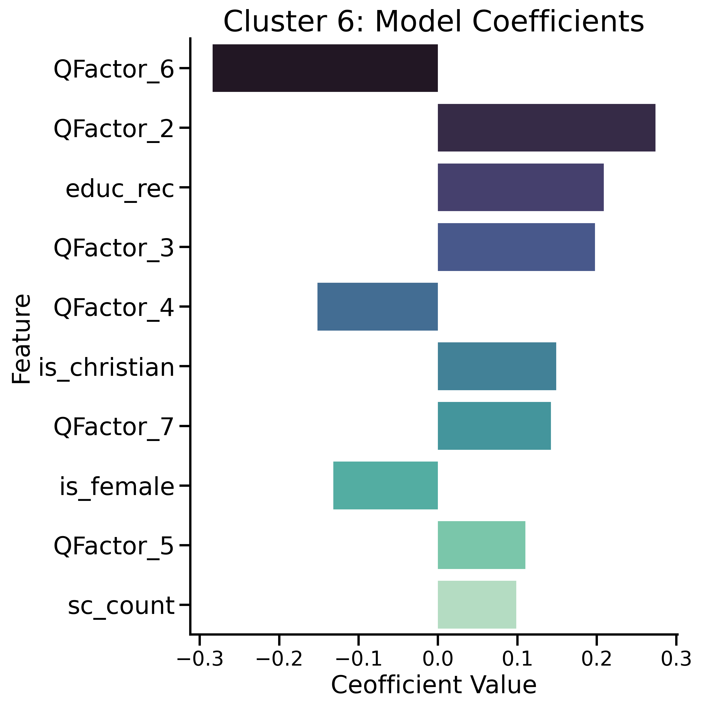

# Segmenting Audiences for Campaign Communications
## Cluster Analysis of Americans’ Views on Science
### By: Jill Mizell

# Problem Statement

A global public health organization is planning an international public education campaign to promote scientific understanding and support for scientific and technological research and advancement in a number of key markets. The first step will be to gain insight into different audience segments to understand how attitudes toward a range of topics in science vary, to inform messaging strategy.

Questions include:
- How do audiences cluster based on their beliefs about science?
- How do remaining attitudinal and self-reported behavioral variables coalesce to represent latent constructs?
- How well do these constructs, combined with demographic features, predict audience segment?

# Methods

- Clustering: The goal of kmeans cluster analysis is to find optimal groupings for the observations in a data set. Ideally the observations grouped into a cluster are highly similar to one another, and each cluster is unique from the other clusters.
- Decomposition: The goal of factor analysis is to identify overlap in, or correlation between variables and create a new set of factors that represent the same latent traits as the original variables, but using fewer dimensions and reducing redundancy.
- Classification: The primary goal of classification will be to gain insight into the key markets and the audience segments (clusters). Since interpretation is the priority, the models for comparison will be logistic regression with regularization using ridge, lasso and elasticnet.

# Data

Pew Research Center, a nonpartisan research organization that conducts regular and ongoing public opinion research studies, conducted an International Science Survey in 20 different countries between October 1, 2019 to March 15, 2020. The full dataset contains 244 features (including a survey weight variable) and 32,330 observations. The dataset can be obtained from Pew's [website](https://www.pewresearch.org/science/dataset/international-science-survey/).

This analysis focused on the US market (subset n=1,502), and used 84 of the columns. Most variables are ordinal categorical and were recoded to between -1 and 1, where 1 is the 'affirmative' response and -1 is the 'opposing' response. Missing values, coded as 'don't know' or 'refused', were recoded to the mid-point value of 0.

## Data Dictionary: Features for Cluster Analysis

The following 21 features were used for the cluster analysis:

| Question Num | Wording |
| --- | --- |
| Q5 | Overall, would you say developments in science have had a mostly positive effect on society, a mostly negative effect on society or would you say there have been equal positive and negative effects on society? |
| Q9a | In your opinion, are government investments in scientific research aimed at advancing knowledge usually worthwhile for society over time, or are they not worth the investment? |
| Q11a | Consider all the advantages and disadvantages of using robots to automate many jobs humans have done in the past. Overall would you say this has mostly been a good thing or a bad thing for society? |
| Q11b | Consider all the advantages and disadvantages of the development of artificial intelligence. Overall would you say this has mostly been a good thing or a bad thing for society? |
| Q11c | Consider all the advantages and disadvantages of the government’s space exploration program. Overall would you say this has mostly been a good thing or a bad thing for society? |
| Q12a | Do you think scientific research on gene editing to change people's genetic characteristics is appropriate or misusing technology? |
| Q12b | Do you think scientific research on cloning of animals is appropriate or misusing technology? |
| Q12c | Do you think scientific research on new technologies to help women get pregnant is appropriate or misusing technology? |
| Q15 | Thinking about scientists, which of these statements comes closer to your own view, even if neither is exactly right? |
| Q16a | Thinking about childhood vaccines for diseases such as measles, mumps and rubella, would you rate the risk of side effects as high, medium, low, or none at all? |
| Q16b | Thinking about childhood vaccines for diseases such as measles, mumps and rubella, would you rate the preventative health benefits as high, medium, low, or none at all? |
| Q18 | Do you think it is generally safe or unsafe to eat fruits and vegetables grown with pesticides, or do you not know enough about this to say? |
| Q19 | Do you think it is generally safe or unsafe to eat food and drinks with artificial preservatives, or do you not know enough about this to say? |
| Q20 | Do you think it is generally safe or unsafe to eat genetically modified foods, or do you not know enough about this to say? |
| Q23a | Now, thinking about gene editing that can be used to change a baby’s genetic characteristics. Would you say it is appropriate or misusing technology to change a baby’s genetic characteristics to make the baby more intelligent? |
| Q23b | Now ... Would you say it is appropriate or misusing technology to change a baby’s genetic characteristics to reduce the risk of a serious disease or condition that could occur over the course of the baby’s lifetime? |
| Q23c | Now ... Would you say it is appropriate or misusing technology to change a baby’s genetic characteristics to treat a serious disease or condition the baby would have at birth? |
| Q29 | How much do you think human activity, such as the burning of fossil fuels, contributes to global climate change — a great deal, some, not too much or not at all? |
| Q33 | In your opinion, do you think there is generally a conflict between science and religion, or not? |
| Q36 | Thinking about evolution, which comes closer to your view? |
| Q37 | In your opinion, can scientific explanations and religious explanations for the origins of life on Earth be compatible, or do you not think so? |

# KMeans Cluster Analysis

- CLUSTER 1: positive on technology, negative on genetic modification, negative on evolution and climate change but believe science and religion are compatible.
- CLUSTER 2: trust scientists, acknowledge climate change, negative on chemicals, gene editing, designer babies, tech
- CLUSTER 3: skeptical benefits of science, negative on tech, chemicals, genetic mod EXCEPT for health reasons, don’t trust scientists
- CLUSTER 4: positive on scientific attitudes but disagree slightly that rligion and science are compatible
- CLUSTER 5: negative on scientific attitudes, see conflict between religion and science
- CLUSTER 6: positive on scientific attitudes but believe science and religion are compatible

## Data Dictionary: Features for Factor Analysis

The following 41 features were used for the cluster analysis:

| Question Num | Wording |
| --- | --- |
| Q1 | Overall, are you satisfied or dissatisfied with the way things are going in (survey public) today? |
| Q2a | How much do you trust ____ to do what is right for (survey public) — a lot, some, not too much, or not at all? a. the national government' |
| Q2b | How much do you trust ____ to do what is right for (survey public) — a lot, some, not too much, or not at all? b. the military |
| Q2c | How much do you trust ____ to do what is right for (survey public) — a lot, some, not too much, or not at all? c. the news media |
| Q2d | How much do you trust ____ to do what is right for (survey public) — a lot, some, not too much, or not at all? d. scientists |
| Q2e | How much do you trust ____ to do what is right for (survey public) — a lot, some, not too much, or not at all? e. business leaders |
| Q4a | I'd like you to compare (survey public) to other nations ... Do you think (survey public) is the best in the world, above average, average or below average? a. its scientific achievements |
| Q4b | I'd like you to compare (survey public) to other nations ... Do you think (survey public) is the best in the world, above average, average or below average? b. its political system |
| Q4c | I'd like you to compare (survey public) to other nations ... Do you think (survey public) is the best in the world, above average, average or below average? c. its economy |
| Q4d | I'd like you to compare (survey public) to other nations ... Do you think (survey public) is the best in the world, above average, average or below average? d. its military |
| Q4e | I'd like you to compare (survey public) to other nations ... Do you think (survey public) is the best in the world, above average, average or below average? e. its STEM education in [grades K-12] |
| Q4f | I'd like you to compare (survey public) to other nations ... Do you think (survey public) is the best in the world, above average, average or below average? f. its medical treatments |
| Q4g | I'd like you to compare (survey public) to other nations ... Do you think (survey public) is the best in the world, above average, average or below average? g. its technological achievements |
| Q4h | I'd like you to compare (survey public) to other nations ... Do you think (survey public) is the best in the world, above average, average or below average? h. its STEM education in colleges and universities |
| Q7 | Thinking about all the important goals for (survey public), how important do you think it is for (survey public) to be a world leader in scientific achievements? |
| Q24a | I'd like you to think about some possible environmental problems. Do you think ____ is a big problem, a moderate problem, a small problem or not a problem in (survey public)? a. air pollution |
| Q24b | I'd like you to think about some possible environmental problems. Do you think ____ is a big problem, a moderate problem, a small problem or not a problem in (survey public)? b. pollution of rivers, lakes and oceans |
| Q24c | I'd like you to think about some possible environmental problems. Do you think ____ is a big problem, a moderate problem, a small problem or not a problem in (survey public)? c. extinction of plant and animal species |
| Q24e | I'd like you to think about some possible environmental problems. Do you think ____ is a big problem, a moderate problem, a small problem or not a problem in (survey public)? e. the amount of garbage, waste and landfills |
| Q24f | I'd like you to think about some possible environmental problems. Do you think ____ is a big problem, a moderate problem, a small problem or not a problem in (survey public)? f. loss of forests |
| Q25 | Which of these statements comes closer to your view, even if neither is exactly right? Creating jobs should be the top priority, even if the environment suffers to some extent OR Protecting the environment should be given priority, even if it causes slower economic growth and some loss of jobs |
| Q26a | Do you favor or oppose using more ____ as a source of energy in (survey public)? a. solar power |
| Q26b | Do you favor or oppose using more ____ as a source of energy in (survey public)? b. wind power |
| Q26c | Do you favor or oppose using more ____ as a source of energy in (survey public)? c. coal |
| Q26d | Do you favor or oppose using more ____ as a source of energy in (survey public)? d. natural gas |
| Q26e | Do you favor or oppose using more ____ as a source of energy in (survey public)? e. nuclear power |
| Q26f | Do you favor or oppose using more ____ as a source of energy in (survey public)? f. oil |
| Q26g | Do you favor or oppose using more ____ as a source of energy in (survey public)? g. hydropower |
| Q27 | Right now, which of these do you think should be the more important priority for addressing (survey public)'s energy supply? |
| Q28 | In your view, is global climate change a very serious problem, somewhat serious, not too serious or not a problem? |
| Q30 | Do you think the national government is doing too much, too little, or about the right amount to reduce the effects of global climate change? |
| Q31 | Do you think global climate change is affecting [IN US: your local community/ELSE: The area where you live] a great deal, some, not too much or not at all? |
| Q32 | How important is religion in your life — very important, somewhat important, not too important or not at all important? |
| Q34 | Thinking about your own beliefs, how often would you say your religious beliefs conflict with science — often, sometimes, rarely or never? |
| Q39 | How often do you see, hear or read something in the news about science — often, sometimes, rarely or never? |
| Q40 | Overall, how would you rate the job news media do in covering science? |
| Q41a | Thinking about news reports of scientific research findings, do you think the following is a problem or is it not a problem? a. the public doesn't know enough about science to really understand research findings covered in the news |
| Q41b | Thinking about news reports of scientific research findings, do you think the following is a problem or is it not a problem? b. the news media oversimplify scientific research findings |
| Q41c | Thinking about news reports of scientific research findings, do you think the following is a problem or is it not a problem? c. science researchers overstate the implications of their research findings |
| Q42 | Which of these statements comes closer to your view, even if neither is exactly right? (survey public) can't solve many of its important problems OR As (nationality group), we can always find ways to solve our problems and get what we want |
| Q43 | Which of these do you think is the better way to solve (survey public's) most pressing problems, even if neither is exactly right? Rely more on people with practical experience with the problems, even if they aren't considered experts OR Rely more on people who are considered experts about the problems, even if they don't have much practical experience |

# Factor Analysis

- "QFactor_1": "Environmental issues"
- "QFactor_2": "Patriotic sentiment"
- "QFactor_3": "Dissatisfaction but trust in media, experts"
- "QFactor_4": "Favor fossil fuels not renewable energy sources"
- "QFactor_5": "Favor renewable energy sources"
- "QFactor_6": "Religion is important and conflicts with science"
- "QFactor_7": "Satisfied and trust government, business"
- "QFactor_8": "Positive about STEM education in country",
- "QFactor_9": "Science knowledge, reporting not good enough"

# Data Dictionary: Features for Logistic Regression

| Feature | Description |
| --- | --- |
| QFactor_1 | Environmental issues |
| QFactor_2 | Patriotic sentiment |
| QFactor_3 | Dissatisfaction but trust in media, experts |
| QFactor_4 | Favor fossil fuels not renewable energy sources |
| QFactor_5 | Favor renewable energy sources |
| QFactor_6 | Religion is important and conflicts with science |
| QFactor_7 | Satisfied and trust government, business |
| QFactor_8 | Positive about STEM education in country |
| QFactor_9 | Science knowledge, reporting not good enough |
| is_female | Gender |
| age_rec | Age (recoded) |
| educ_rec | Education (recoded) |
| ideo_rec | Political ideology (conservative = lower values, liberal = higher values) |
| sc_bin | Taken science course (binary) |
| sc_count | Number of science courses taken |
| is_christian | Think of yourself as Christian |
| is_protestant | Identify as protestant religion |
| is_catholic | Identify as Catholic |
| is_ath_ag | Identifies as atheist or agnostic |
| attend_rec | How often attend religious services |
| pray_rec | How often pray |
| is_white | Respondent race is white non-Hispanic |
| is_black | Respondent race is Black non-Hispanic |
| is_hisp | Respondent ethnicity is Hispanic |
| pid_rec | Political party identification (Republican = lower values, Democrat = higher values)
| is_genz | Generation in the U.S.: Gen Z (1997-) |
| is_millenial | Generation in the U.S.: Millennial (1981-1996) |
| is_genx | Generation in the U.S.: Xer (1965-80) |
| is_boomer | Generation in the U.S.: Boomer (1946-64) |
| is_silent | Generation in the U.S.: Silent (1928-45) |
| hh_rec | Number of people living in household |

# Multinomial Logistic Regression with Ridge Regularization

GridSearchCV was used to find optimal hyperparameters for the multinomial Logistic Regression model using the l2 penalty (ridge regularization). The training score was 0.400, and the testing score was 0.403.

## Model Coefficients: Cluster 1

## Model Coefficients: Cluster 2

## Model Coefficients: Cluster 3

## Model Coefficients: Cluster 4

## Model Coefficients: Cluster 5

## Model Coefficients: Cluster 6

